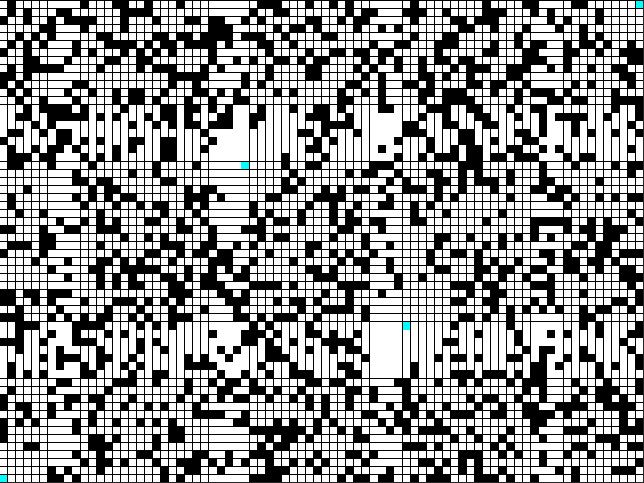
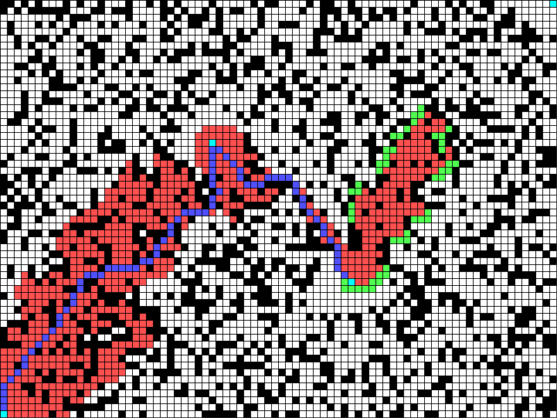

# A Star Pathfinding

This is an A star pathfinding algorithm implemented in Java, using [Processing](https://processing.org/).

The A star algorithm finds the optimal path between targets it must reach in order, navigating a randomised grid-based maze.
Programming this gave me a better understanding of heuristics and graphs, reinforcing my learning during my computer science A-level studies.

A grid-based maze is used, and is initially random. Extra walls can be placed by right-clicking.

There are multiple targets for the pathfinding algorithm to reach.

To start, just left-click.

