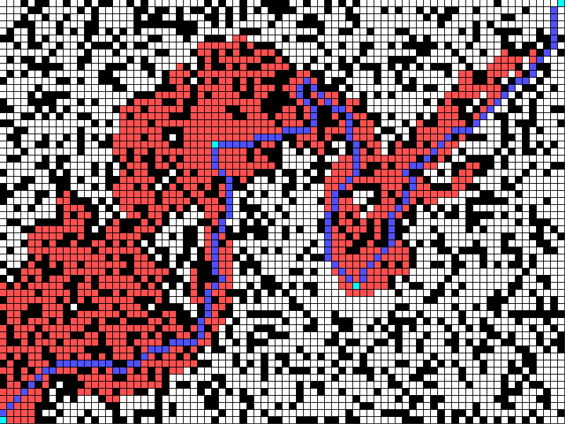

# A Star Pathfinding

This is an A star pathfinding algorithm implementeted in Java, using [Processing](https://processing.org/).

A grid-based maze is used, and is initially random. Extra walls can be placed by right-clicking.

There are multiple targets for the pathfinding algorithm to reach.

To start, just left-click.

